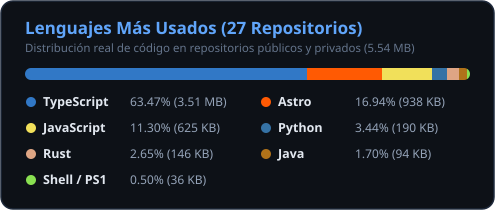

<div align="center">

  <!-- Header Cinematográfico con Ondas Fluidas (100% Responsive) -->
  

  <!-- Máquina de Escribir Dinámica (Escalable para Móviles) -->
  <p align="center">
    <a href="https://github.com/Danvb15">
      
    </a>
  </p>

  <p align="center">
    📍 <strong>Barranquilla, Atlántico (Colombia) 🇨🇴</strong>
  </p>

  <!-- Badges de Estado y Métricas -->
  <p align="center">
    <a href="https://github.com/Danvb15">
      
    </a>
    
    
    
  </p>

  <!-- Botones de Acción Rápida -->
  <p align="center">
    <a href="mailto:danvb.dev@gmail.com">
      
    </a>
    <a href="https://linkedin.com/in/Danvb15" target="_blank">
      
    </a>
    <a href="https://github.com/Danvb15?tab=repositories">
      
    </a>
  </p>

</div>

---

### 🧬 Ficha Técnica de Operador // Interactive Cyberdeck & Skill Tree

```bash
[CYBERDECK v2.4] Operator: Daniel Vásquez [danvb]
Class: Systems Architect · Status: Production Ready
```

> *💡 Toca cualquiera de los **Loadouts** o **Habilidades** para desplegar sus perks:*

#### 🎯 Selector de Modos de Operación // Loadouts

<details open>
  <summary>🛡️ <strong>Loadout 01: Arquitecto Empresarial & Backend Crítico</strong></summary>
  <br />

```yaml
configuracion:
  rol: "Backend Architect & Data Integrity Specialist"
  enfoque: "Alta concurrencia, transacciones ACID y multi-tenant."
  stack: ["Java 21", "Spring Boot 3", "PostgreSQL", "Redis", "Docker"]
  perk_clave: "Optimistic Locking & Inmutable Audit Trail"
  metrica: "Disponibilidad 99.9% · Latencia transaccional <120ms"
```
</details>

<details>
  <summary>🦀 <strong>Loadout 02: Ingeniero Low-Level, Desktop & Criptografía</strong></summary>
  <br />

```yaml
configuracion:
  rol: "Systems & Native Desktop Engineer"
  enfoque: "Software ultraligero con custodia segura de credenciales."
  stack: ["Rust", "Tauri 2", "React / TS", "SQLite", "OS Keyring"]
  perk_clave: "0 Plaintext Secrets (Windows Credential / SecretService)"
  metrica: "Consumo de RAM <35MB · 0 memory leaks"
```
</details>

<details>
  <summary>🤖 <strong>Loadout 03: Agentes de Inteligencia Artificial & Fullstack</strong></summary>
  <br />

```yaml
configuracion:
  rol: "AI Solutions Engineer & Modern Web Architect"
  enfoque: "Automatización con recuperación vectorial (RAG) e interfaces sub-100ms."
  stack: ["FastAPI (Python)", "pgvector", "Claude API", "Astro", "Tailwind"]
  perk_clave: "Vector Context Retrieval con mitigación de alucinaciones"
  metrica: "Streaming con esquemas fuertemente tipados en Pydantic"
```
</details>

<br />

#### 📊 Árbol de Habilidades & Perks (Mobile-Friendly)

<details open>
  <summary><strong>🏛️ Arquitectura & Clean Code</strong> — <code>[99% S-RANK]</code></summary>
  <blockquote>
    <strong>• Pasiva:</strong> <em>Zero Spaghetti</em> — Inmunidad al acoplamiento severo.<br />
    <strong>• Efecto:</strong> Código modular estructurado para escalar sin refactors dolorosos.<br />
    <strong>• Arsenal:</strong> Clean Architecture, DDD, 100% Type Safety.
  </blockquote>
</details>

<details>
  <summary><strong>⚙️ Backend & Transaccionalidad</strong> — <code>[94% S-RANK]</code></summary>
  <blockquote>
    <strong>• Pasiva:</strong> <em>ACID Guardian</em> — Cero inconsistencias en ventas masivas simultáneas.<br />
    <strong>• Efecto:</strong> Pools de conexiones afinados con tiempo de respuesta mínimo.<br />
    <strong>• Arsenal:</strong> Spring Boot 3, PostgreSQL, Redis, Flyway Migrations.
  </blockquote>
</details>

<details>
  <summary><strong>🦀 Desktop Nativo & Rust</strong> — <code>[85% A-RANK]</code></summary>
  <blockquote>
    <strong>• Pasiva:</strong> <em>Memory Safety</em> — Manejo de memoria seguro sin Garbage Collector.<br />
    <strong>• Efecto:</strong> Destrucción de secretos criptográficos en RAM tras el login.<br />
    <strong>• Arsenal:</strong> Rust, Tauri 2, OS Keyring, SQLite embebido.
  </blockquote>
</details>

<details>
  <summary><strong>🧠 IA Vectorial & RAG</strong> — <code>[88% A-RANK]</code></summary>
  <blockquote>
    <strong>• Pasiva:</strong> <em>Hallucination Suppressor</em> — Contexto estructurado delimitado.<br />
    <strong>• Efecto:</strong> Búsqueda por similitud de cosenos en pgvector en milisegundos.<br />
    <strong>• Arsenal:</strong> FastAPI Asíncrono, pgvector, Claude API, Redis.
  </blockquote>
</details>

<details>
  <summary><strong>🛡️ Infraestructura & Homelab</strong> — <code>[90% A-RANK]</code></summary>
  <blockquote>
    <strong>• Pasiva:</strong> <em>Zero Open Ports</em> — Acceso remoto cifrado sin exponer puertos a internet.<br />
    <strong>• Efecto:</strong> Aislamiento total de entornos con LXC y Máquinas Virtuales.<br />
    <strong>• Arsenal:</strong> Proxmox VE, Docker Compose, WireGuard, Tailscale, Linux.
  </blockquote>
</details>

<details>
  <summary><strong>☕ Nivel de Cafeína</strong> — <code>[100% OVERCLOCK]</code></summary>
  <blockquote>
    <strong>• Pasiva:</strong> <em>Hyperfocus State</em> — Inmunidad a la fatiga nocturna de debugging.<br />
    <strong>• Efecto:</strong> +50% velocidad de tipeo, +100% paciencia ante errores crípticos.<br />
    <strong>• Combustible:</strong> Café de especialidad colombiano 🇨🇴.
  </blockquote>
</details>

---

### 💻 Terminal de Ingeniería // Live CLI & Cyberpunk Experience

```bash
# ⚡ En Linux, macOS o Git Bash (Con colores y música):
curl -sL https://raw.githubusercontent.com/Danvb15/Danvb15/main/danvb.sh | bash

# ⚡ En Windows PowerShell (Con colores y música):
irm https://raw.githubusercontent.com/Danvb15/Danvb15/main/danvb.ps1 | iex
```
> *💡 **100% Real:** Al ejecutar el comando en tu terminal, se abre una consola interactiva Cyberpunk a todo color, con música de fondo en loop y telemetría de sistemas.*

---

```
╭─ 🔴 🟡 🟢 ──── daniel@station ────╮
│ ➜ danvb-cli v2.4 (x86_64-linux)   │
╰───────────────────────────────────╯
```

<details open>
  <summary><strong>▶ <code>danvb benchmark</code></strong> (Telemetría de rendimiento y latencias)</summary>
  <br />

```bash
[INFO] Benchmarking data layer & microservices...
------------------------------------------------
SUBSYSTEM         PROTO    STATUS    p99 LATENCY
/core/keyring     Rust     SALUDABLE      1.2ms
/inventory/pos    Java     200 OK        34.8ms
/rag/pgvector     FastAPI  200 OK        78.4ms
/wireguard-mesh   P2P/UDP  ACTIVO         3.8ms
------------------------------------------------
[STATUS] 0 memory leaks · Integridad ACID: 100%
```
</details>

<details>
  <summary><strong>▶ <code>danvb sysinfo</code></strong> (Especificaciones del nodo de desarrollo)</summary>
  <br />

```bash
[NODE SPECIFICATIONS]
• OS / Kernel    : Linux Debian Core & Proxmox VE
• Architecture   : x86_64 / Concurrencia asíncrona
• Toolchains     : Rust, OpenJDK 21, Python 3.12, Node 20
• Security Layer : OS Keyring · Redes WireGuard P2P
• Primary Goal   : Construir software modular y mantenible
```
</details>

<details>
  <summary><strong>🚨 <code>danvb quest --incident-03am</code></strong> (Mini-Misión: ¡Salva el servidor!)</summary>
  <br />

> **SITUACIÓN:** Son las 03:14 AM. Suena la alarma de PagerDuty: La latencia de base de datos se disparó a **4,500ms** y el CPU está al 98%. ¿Qué decisión tomas?

<details>
  <summary>🔴 <strong>Opción A: Reiniciar el servidor a ciegas</strong></summary>
  <br />

  ```diff
  - 💥 ERROR 500: ¡Desastre total!
  - Reiniciaste y corrompiste transacciones en vuelo del pool JDBC.
  - Tu equipo de guardia te busca con antorchas. (-500 Aura)
  ```
</details>

<details>
  <summary>🟢 <strong>Opción B: Analizar pg_stat_activity, locks de PostgreSQL y caché Redis</strong></summary>
  <br />

  ```diff
  + 🎯 ¡ÉXITO TOTAL!
  + Detectaste un lock exclusivo sin índice en una transacción masiva.
  + Creaste un índice concurrente y purgaste la caché caliente.
  + Latencia restaurada a 38ms. El servidor respira en paz. (+1000 XP Senior)
  ```
</details>

<details>
  <summary>🟡 <strong>Opción C: "Fue culpa de los DNS" y volver a dormir</strong></summary>
  <br />

  ```bash
  ☕ Respuesta legendaria de dev senior.
  Nadie sabe si es broma o realidad, pero nadie se atreve a contradecirte.
  ```
</details>

</details>

<details>
  <summary><strong>▶ <code>danvb infra</code></strong> (Topología de Red & Laboratorio Self-Hosted)</summary>
  <br />

```
┌── PROXMOX VE HYPERVISOR ───────────────┐
│ ├─ LXC Containers (Docker & Services)  │
│ ├─ Virtual Machines (Debian Core)      │
│ └─ Mesh Network (WireGuard & Tailscale)│
└────────────────────────────────────────┘
```
</details>

---

### 🛠️ Arsenal Tecnológico // Skill Stack

<div align="center">

  <p><strong>Lenguajes & Backend Core</strong></p>
  <a href="https://skillicons.dev">
    
  </a>

  <br /><br />

  <p><strong>Frontend & UI Systems</strong></p>
  <a href="https://skillicons.dev">
    
  </a>

  <br /><br />

  <p><strong>Bases de Datos, Caché & Almacenamiento</strong></p>
  <a href="https://skillicons.dev">
    
  </a>

  <br /><br />

  <p><strong>Infraestructura, DevOps & Herramientas</strong></p>
  <a href="https://skillicons.dev">
    
  </a>

</div>

---

### 🚀 Proyectos de Ingeniería Destacados

> *Casos de estudio enfocados en arquitectura sólida, alto rendimiento y seguridad:*

#### 🛡️ 1. REMOTE MANAGER
*Administración Remota & Custodia Criptográfica en OS Keyring*
* Software de escritorio multiplataforma para administración centralizada de servidores SSH y RDP.
* **Seguridad Crítica:** Aísla credenciales en el almacén de claves del sistema operativo (**OS Keyring nativo**) y destruye secretos en memoria RAM tras la autenticación (0 contraseñas en texto plano).
* **Stack:**
  <br />
  
* **Destacado:** IPC tipado Rust-React · Consumo de memoria RAM sub-30MB en escritorio.

---

#### 📦 2. TECHSTOCK
*Plataforma Distribuida Multi-Tenant de Inventario & POS*
* Arquitectura SaaS para retail tecnológico con soporte web y móvil para escaneo rápido de stock.
* **Integridad de Datos:** Bloqueo optimista (*Optimistic Locking*) para prevenir sobreventas concurrentes y auditoría contable inmutable de cada transacción.
* **Stack:**
  <br />
  
* **Destacado:** Aislamiento estricto multi-tenant · Migraciones versionadas en Flyway.

---

#### 🤖 3. AI BUSINESS AGENT
*Pipeline RAG & Memoria Semántica Vectorial Asíncrona*
* Agente inteligente para automatización y análisis contextual de documentos empresariales.
* **Arquitectura RAG:** Búsqueda semántica por similitud de cosenos en **pgvector**, caché de sesiones de baja latencia con **Redis** y mitigación rigurosa de alucinaciones con modelos Claude.
* **Stack:**
  <br />
  
* **Destacado:** Recuperación vectorial sub-100ms · Validación estricta con esquemas Pydantic.

---

#### 🖥️ 4. HOMELAB & INFRAESTRUCTURA SEGURA
*Virtualización, Contenedores & Redes Malladas Cifradas*
* Infraestructura self-hosted sobre **Proxmox VE** con segmentación entre Máquinas Virtuales y contenedores LXC orquestados en Docker.
* **Seguridad de Red:** Acceso remoto cifrado punto a punto vía **WireGuard** y **Tailscale** (*Zero Open Ports* a internet pública) con proxy inverso Nginx SSL.
* **Stack:**
  <br />
  
* **Destacado:** Entornos reproducibles y aislados · Almacenamiento en nube privada.

---

### 🐍 Snake Contribution Matrix // Comiendo Commits

<div align="center">
  
</div>

---

### 📊 Métricas & Actividad en GitHub

<div align="center">
  <p align="center">
    
  </p>
  <p align="center">
    
  </p>
  <p align="center">
    
  </p>
</div>

---

### 🎧 Coding Vibe // Frecuencia de Enfoque

```bash
╭────────────────────────────────────────────────────────╮
│ ♫ NOW PLAYING: Mac Quayle - 1.0_8-whatsyourask.m4p     │
│ [████████████████░░░░░░░░] 01:42 / 02:15 (Mr. Robot)   │
│ ⚡ Focus: 100% · Status: Shipping Code                 │
╰────────────────────────────────────────────────────────╯
```

---

### 🎮 Zona Interactiva // Curiosidades

<details>
  <summary><strong>👉 Haz clic aquí para ver <code>danvb --fun-facts</code></strong></summary>
  <br />

  ```yaml
  curiosidades:
    - 🇨🇴 "Programando con orgullo desde Barranquilla, tierra de alegría y buen café."
    - 🛡️ "Credenciales en texto plano: un crimen arquitectónico. El OS Keyring es ley."
    - ⚡ "Si un proceso crítico se puede beneficiar de Rust o tipado estricto, ese es el camino."
    - 🎯 "100% Type Safety: las advertencias del compilador son guías de diseño, no molestias."
    - ☕ "Tasa de conversión comprobada: Café de especialidad ➡️ Código limpio y testeado."
  ```
</details>

<br />

<div align="center">
  <p>
    ¿Tienes un proyecto desafiante, una idea innovadora o quieres hablar de arquitectura de software?<br />
    📬 <strong>¡Conversemos!</strong> Envíame un mensaje a <a href="mailto:danvb.dev@gmail.com"><code>danvb.dev@gmail.com</code></a> o conecta en <a href="https://linkedin.com/in/Danvb15">LinkedIn</a>.
  </p>

  <sub>Hecho con precisión por <a href="https://github.com/Danvb15">Daniel Vásquez</a> · Barranquilla 🇨🇴</sub>

  <br /><br />

  <!-- Footer con Onda Inversa de Cierre Cinematográfico -->
  
</div>
